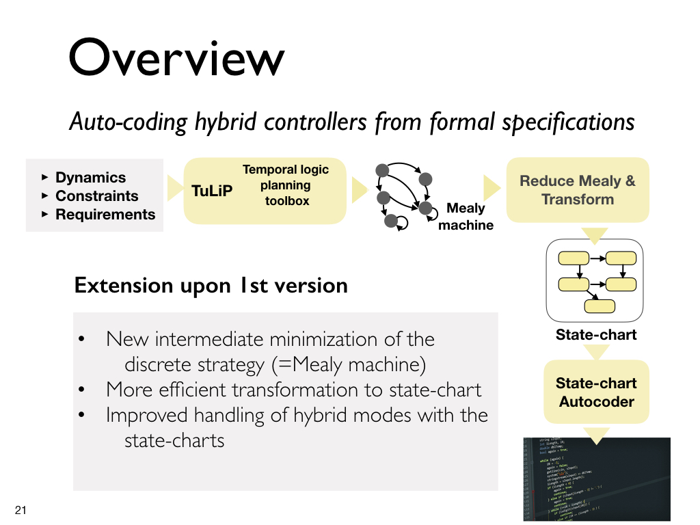

.. SpeX documentation master file, created by
   sphinx-quickstart on Fri Jan 19 15:55:23 2018.
   You can adapt this file completely to your liking, but it should at least
   contain the root `toctree` directive.

Welcome to C-TuLiP's documentation!
====================================

This toolbox presents algorithms for auto-coding hybrid controllers based on formal specifications.

Examples
=========================
.. toctree::
   :maxdepth: 3
   :caption: Contents:

.. automodule:: Examples
   :members:

Interface
=========================

.. automodule:: Interface
   :members:

Domain Specific Language
=========================
.. automodule:: Interface.DSL

Mealy machine reduction
=========================
.. automodule:: Interface.Reduce

Indices and tables
==================

* :ref:`genindex`
* :ref:`modindex`
* :ref:`search`

